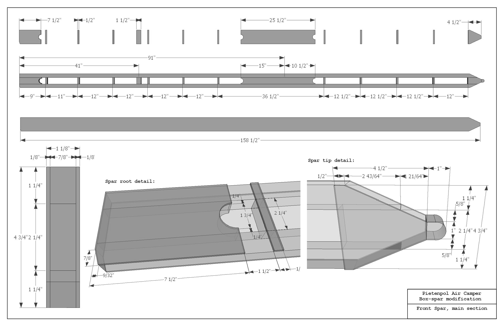

# 00002. Wing spars are constructed as box spars

2024-01-15

## Status

__Final__

## Context

The original drawings for the Pietenpol wing, contain spars made out of a solid spruce spar,
with parts of the spar routed to make it lighter. The problem is that using a solid spar 
requires a very good, fault free piece of wood that is very hard to come by.

## Decision

Instead of using a solid spar, the wing spars can be constructed using smaller pieces of
wood, using a 5 ply aircraft grade multiplex as shear web. See this:

## Consequences

During the build up of the spar, it is important to check all joints to ensure that the strenght
of the spar equals or exceeds the strength of a solid spar. Secondly, the weight of a constructed
spar is probably a bit less as the shear web is very light and strong, if compared to the
routed parts of the solid spar.